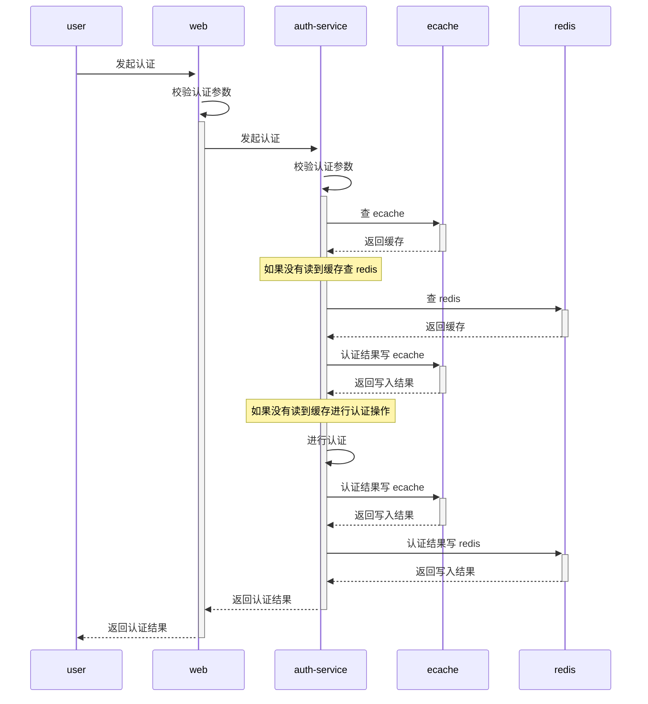

# 01 时序图

# 02 缓存使用

**Situation:**
    在需要调用其余服务 rpc 进行查询物品信息时，用到了本地缓存
    
**Task**
    1.分析使用本地缓存还是第三方缓存比如 redis
    2.确定缓存策略，懒加载还是定时刷新
 
 **Action**
    1.使用本地缓存，物品信息就算全量缓存起来也不超过几十M，和堆内存大小对比，容量是可以接受的，而且本地缓存的性能是优于 redis 的
    2.通过 job 定时批量去拉取接口并缓存起来（调用的 rpc 提供了分页拉取的接口，支持定时拉取，并缓存全量），优点：避免了懒加载在触发进行加载的那一次请求 rt 上升，缺点：缓存了全量数据，部分数据可能不会访问到
    
 **Result**
    1.提高了接口响应速度
    2.减少了查询接口提供方的压力
    
 **Think**
    1.只缓存会使用到数据，在拉取 job 中过滤部分数据
