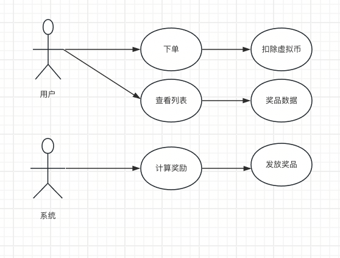

# 01 动手题

## 1.1 抽奖系统用例图

## 1.2 用例描述

+ 范围：抽奖业务
+ 主参与者：用户、发奖系统
+ 概述：用户选择要抽取的奖池后，可以通过消耗虚拟币来获取相应的抽奖机会进行抽奖，抽奖后系统会给用户发放对应的奖品
+ 项目相关人员和利益
    + 主执行者：用户希望通过抽奖获得希望的奖品
    + 内部执行者：关注抽奖流程的实现，抽奖数据的可靠落地
    + 辅助执行者：需要虚拟币系统来支撑虚拟币扣除

+ 前置条件：用户必须处于已登录
+ 最小保证：不管系统出现了什么问题，只有用户下单成功，就不允许抽奖失败
+ 成功保证：
    + 在用户虚拟币余额足够的情况一些，保证虚拟币扣除成功
    + 保证抽奖成功
    + 保证用户奖品发放成功

+ 触发事件：用户决定要抽奖，首先要看到抽的奖池列表，那么用户查看奖池才是用例的触发事件。
+ 主成功场景
    + 用户查看奖池
    + 用户选择奖池，进行抽奖
    + 扣除用户虚拟币，返回订单号
    + 获取抽奖结果，展示给用户抽到的奖品信息
    + 系统发放奖品

# 02 思考题
1. 数据库最常使用，一般系统都会使用到数据库
2. 数据库存的是关系型数据，更贴近业务
3. 数据库设计的核心就是对需求分析的理解